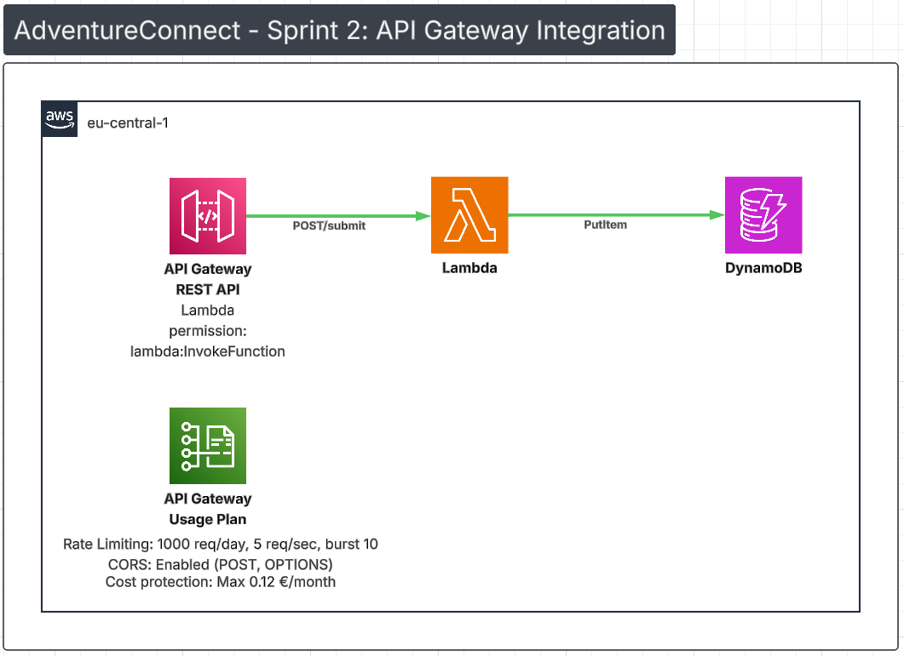
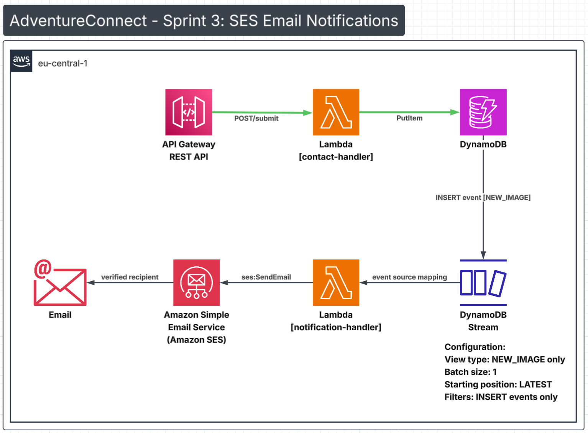

# AdventureConnect Contact System

A serverless contact form system built on AWS using Infrastructure as Code (Terraform). This project demonstrates cloud architecture fundamentals including serverless computing, NoSQL databases, event-driven architecture, static website hosting, and IAM security best practices.

## Project Status

**Current Phase:** S3 + CloudFront Frontend (Sprint 4 Complete ✅)

**Completed:**
- ✅ Sprint 1: Lambda + DynamoDB backend
- ✅ Sprint 2: API Gateway + CORS + Rate Limiting
- ✅ Sprint 3: SES email notifications via event-driven architecture
- ✅ Sprint 4: S3 + CloudFront static website frontend

**Next:**
- CloudWatch monitoring and alerting

**Note:** Infrastructure is deployed during active development sprints, then destroyed to minimize costs. All code is version-controlled and can be redeployed via Terraform in ~2 minutes.

## Architecture

### Sprint 1: Serverless Backend


**Components:**
- Lambda function (Python 3.11) processes submissions
- DynamoDB stores data with PAY_PER_REQUEST billing
- IAM roles with scoped permissions (table ARN, not wildcard)
- CloudWatch logs for monitoring

**Key Learning:** Lambda cold starts (~860ms) vs warm starts (~260ms)

### Sprint 2: API Gateway Integration



**Components:**
- API Gateway REST API provides public HTTPS endpoint
- CORS enabled for browser cross-origin requests
- Rate limiting: 1000 requests/day, 5 req/sec, burst 10
- Lambda permission grants API Gateway invocation access

**Key Learning:** Two permission systems — IAM Role (what Lambda can access) vs Lambda Permission (who can invoke Lambda)

### Sprint 3: SES Email Notifications



**Components:**
- DynamoDB Streams (NEW_IMAGE) triggers notification Lambda on every INSERT
- Dedicated notification Lambda reads stream record and sends email via SES
- SES delivers email to verified recipient address
- Separate IAM role for notification Lambda — SES permissions isolated from contact handler

**Key Learning:** Event-driven decoupling — form submission succeeds independently of email delivery. SES failures cannot affect the user-facing API response.

**Sandbox limitation:** SES account is in sandbox mode. In production, AWS support request required to send to unverified addresses.

### Sprint 4: S3 + CloudFront Frontend


**Components:**
- S3 bucket hosts static HTML/CSS/JS contact form (private, no public access)
- CloudFront distribution serves content over HTTPS with global edge caching
- Origin Access Control (OAC) restricts S3 access to designated CloudFront distribution only
- Bucket policy scoped to specific CloudFront distribution ARN via Condition block
- Terraform outputs expose CloudFront URL and API endpoint after every deployment

**Two separate request flows:**
- Page load: Browser → CloudFront → S3 → index.html returned and cached
- Form submit: Browser → API Gateway → Lambda → DynamoDB → Stream → SES

**Key Learning:** OAC replaces legacy OAI — S3 bucket stays private, CloudFront signs requests using sigv4. S3 static website hosting alone rejected due to lack of HTTPS and public bucket requirement.

## Live Website

After deployment via Terraform, the frontend is accessible at the CloudFront URL:

```
https://{distribution-id}.cloudfront.net
```

Get the URL after deployment:
```bash
terraform output cloudfront_domain_name
```

## API Endpoint

After deployment via Terraform, the API endpoint follows this format:

```
https://{api-id}.execute-api.eu-central-1.amazonaws.com/prod/submit
```

Get the URL after deployment:
```bash
terraform output api_endpoint
```

**Example request:**
```bash
curl -X POST https://abc123xyz.execute-api.eu-central-1.amazonaws.com/prod/submit \
  -H "Content-Type: application/json" \
  -d '{"name":"Test User","email":"test@example.com","message":"Hello"}'
```

**Example response:**
```json
{
  "message": "Submission received",
  "submissionId": "550e8400-e29b-41d4-a716-446655440000"
}
```

**Security:** Rate limiting configured (1000 req/day max) to prevent abuse and cap costs at 0.12€ per month worst case.

## Project Structure

```
.
├── terraform/
│   ├── provider.tf                  # AWS provider configuration
│   ├── dynamodb.tf                  # DynamoDB table + Streams configuration
│   ├── iam.tf                       # IAM roles and policies (contact handler)
│   ├── lambda.tf                    # Contact form Lambda function
│   ├── api_gateway.tf               # API Gateway REST API + CORS + rate limiting
│   ├── notification_lambda.tf       # Notification Lambda + event source mapping
│   ├── notification_iam.tf          # IAM role, SES policy, Stream policy
│   ├── s3.tf                        # S3 bucket + public access block + bucket policy
│   ├── cloudfront.tf                # CloudFront distribution + OAC
│   ├── outputs.tf                   # CloudFront URL + API endpoint outputs
│   └── variables.tf                 # Input variable definitions
├── lambda/
│   ├── lambda_function.py           # Contact form handler
│   └── notification_handler.py      # SES notification handler
├── frontend/
│   └── index.html                   # Static contact form website
├── postman/
│   └── adventureconnect.json        # Postman collection for API testing
├── diagrams/
│   ├── architecture-sprint1.png
│   ├── architecture-sprint2.png
│   ├── architecture-sprint3.png
│   └── architecture-sprint4.png
├── decisions.md                     # Architectural decisions and trade-offs
├── errors.md                        # Issues encountered and fixes
├── testing-log.md                   # Test results and verification
├── tshoot.md                        # Troubleshooting guides
└── README.md
```

## Prerequisites

- [AWS CLI](https://aws.amazon.com/cli/) configured with credentials
- [Terraform](https://www.terraform.io/downloads) >= 1.0
- AWS account with appropriate permissions
- Verified SES email identities in eu-central-1

## Deployment

### 1. Clone Repository

```bash
git clone https://github.com/horvrobert/adventureconnect-contact-system.git
cd adventureconnect-contact-system
```

### 2. Package Lambda Functions

```bash
cd lambda
zip lambda_function.zip lambda_function.py
zip notification_handler.zip notification_handler.py
cd ..
```

### 3. Configure Variables

Create `terraform/terraform.tfvars` (not committed to Git):

```hcl
sender_email    = "your-verified-sender@example.com"
recipient_email = "your-verified-recipient@example.com"
s3_bucket_name  = "your-unique-bucket-name"
```

### 4. Deploy Infrastructure

```bash
cd terraform
terraform init
terraform plan
terraform apply
```

### 5. Upload Frontend

```bash
aws s3 cp frontend/index.html s3://YOUR-BUCKET-NAME/index.html --region eu-central-1
```

### 6. Get Deployment URLs

```bash
terraform output
```

Update `frontend/index.html` line 619 with the `api_endpoint` output value, then re-upload.

### 7. Verify Deployment

```bash
# Check S3 bucket
aws s3 ls s3://YOUR-BUCKET-NAME --region eu-central-1

# Check CloudFront distribution
aws cloudfront list-distributions --region eu-central-1

# Check DynamoDB table and stream
aws dynamodb describe-table --table-name adventureconnect-submissions --region eu-central-1

# Check Lambda functions
aws lambda get-function --function-name adventureconnect-contact-handler --region eu-central-1
aws lambda get-function --function-name adventureconnect-notification-handler --region eu-central-1

# Check event source mapping (Stream → notification Lambda)
aws lambda list-event-source-mappings --function-name adventureconnect-notification-handler --region eu-central-1
```

## Testing

### Full End-to-End Test (Browser)

1. Open `https://{your-cloudfront-url}.cloudfront.net` in browser
2. Fill in name, email, message
3. Click Send Message
4. Verify success message displayed
5. Check inbox for notification email

### Full End-to-End Test (curl)

```bash
curl -X POST https://YOUR-API-ID.execute-api.eu-central-1.amazonaws.com/prod/submit \
  -H "Content-Type: application/json" \
  -d '{"name":"Test User","email":"test@example.com","message":"Test submission"}'
```

Expected: `{"message":"Submission received","submissionId":"uuid-here"}`

Then check:
1. DynamoDB — record written with all fields
2. CloudWatch `/aws/lambda/adventureconnect-notification-handler` — email sent log
3. Inbox — email received from sender address

### CORS Preflight Test

```bash
curl -X OPTIONS https://YOUR-API-ID.execute-api.eu-central-1.amazonaws.com/prod/submit -v
```

### Verify DynamoDB Entries

```bash
aws dynamodb scan --table-name adventureconnect-submissions --region eu-central-1 --output table
```

### Check CloudWatch Logs

```bash
# Contact handler logs
aws logs tail /aws/lambda/adventureconnect-contact-handler --follow --region eu-central-1

# Notification handler logs
aws logs tail /aws/lambda/adventureconnect-notification-handler --follow --region eu-central-1
```

## Key Learnings

### Sprint 1: Serverless Backend

**Infrastructure as Code:** Terraform manages all AWS resources declaratively. State tracking enables safe infrastructure changes. Resource dependencies handled automatically.

**IAM Security:** Principle of least privilege applied throughout. Resource-scoped permissions (table ARN, not wildcard). Trust policies control service-to-service access.

**DynamoDB Design:** Partition key selection (UUID ensures uniqueness). PAY_PER_REQUEST vs PROVISIONED capacity trade-offs. Auto-scaling without capacity planning.

### Sprint 2: API Gateway Integration

**Two Permission Systems:** IAM Role controls what Lambda can access (DynamoDB, CloudWatch). Lambda Permission controls who can invoke Lambda (API Gateway, EventBridge). Removing Lambda permission causes 500 error with no CloudWatch logs — Lambda is never invoked.

**CORS Configuration:** OPTIONS method with MOCK integration returns CORS headers without invoking Lambda (~10ms vs ~200ms). Browser preflight requests require proper headers. MOCK eliminates 50% of Lambda invocations on browser traffic.

**Rate Limiting:** Usage plans protect against abuse and runaway costs. 1000 req/day limit caps worst-case monthly cost at 0.12€. Requests exceeding limit receive HTTP 429.

### Sprint 3: Event-Driven Architecture

**Decoupling via DynamoDB Streams:** Form submission and email delivery are independent operations. SES failure cannot cause form submission to fail. Stream retries automatically on notification Lambda failure.

**DynamoDB Typed Attribute Format:** Stream records deliver values as `{"S": "value"}` not `"value"`. Every attribute must be unwrapped with the type key (`["S"]`, `["N"]`, etc.). Missing this produces malformed output with no obvious error.

**IAM Blast Radius:** Notification Lambda has its own IAM role with only SES and Stream permissions. Contact handler role has no SES access. Compromise of one Lambda cannot be used to exploit the other.

**SES Resource `"*"` in IAM:** AWS does not support resource-level restrictions for `ses:SendEmail`. No ARN format exists for individual send operations. Compensate with verified identities, sending limits, and CloudWatch alerts.

### Sprint 4: Static Website Hosting

**Two Request Flows:** Page load goes Browser → CloudFront → S3. Form submission goes Browser → API Gateway directly. CloudFront is not involved in form submission — it only serves static files.

**OAC vs OAI:** Origin Access Control replaces legacy Origin Access Identity. OAC uses sigv4 request signing, supports SSE-KMS, and is the current AWS-recommended approach. S3 bucket policy principal is `cloudfront.amazonaws.com` with Condition scoped to specific distribution ARN.

**S3 Security:** All four public access block settings enabled. Bucket has no public access — only CloudFront can read from it via OAC. Direct S3 URL access returns 403.

**Terraform Outputs:** `outputs.tf` exposes CloudFront URL and API endpoint after every apply — essential since API Gateway URL changes on each redeploy.

## Cost Estimation

**Sprint 1 + 2 + 3 + 4 Combined (100 submissions/day):**

| Service | Usage | Monthly Cost |
|---------|-------|--------------|
| API Gateway | 3,000 requests | 0.009€ |
| Lambda (contact handler) | 3,000 invocations | 0€ (free tier) |
| Lambda (notification) | 3,000 invocations | 0€ (free tier) |
| DynamoDB | 3,000 writes | 0.003€ |
| DynamoDB Streams | 3,000 reads | 0€ (free tier) |
| SES | 3,000 emails | 0€ (first 62,000/month free) |
| S3 | 3,000 GET requests | 0€ (free tier) |
| CloudFront | 3,000 requests | 0€ (free tier) |
| **Total** | | **~0.012€** |

**All costs calculated in Euro (€) using 1 USD = 0.86 EUR**

## Roadmap

- [x] Sprint 1: Lambda + DynamoDB backend
- [x] Sprint 2: API Gateway + CORS + Rate Limiting
- [x] Sprint 3: SES email notifications
- [x] Sprint 4: S3 + CloudFront static website frontend
- [ ] Sprint 5: CloudWatch monitoring and alerts

## Documentation

- **decisions.md** — Architectural decisions, alternatives considered, trade-offs
- **errors.md** — Issues encountered, root causes, fixes applied
- **testing-log.md** — Test results, inputs, outputs, execution metrics
- **tshoot.md** — Troubleshooting guides for common failure scenarios