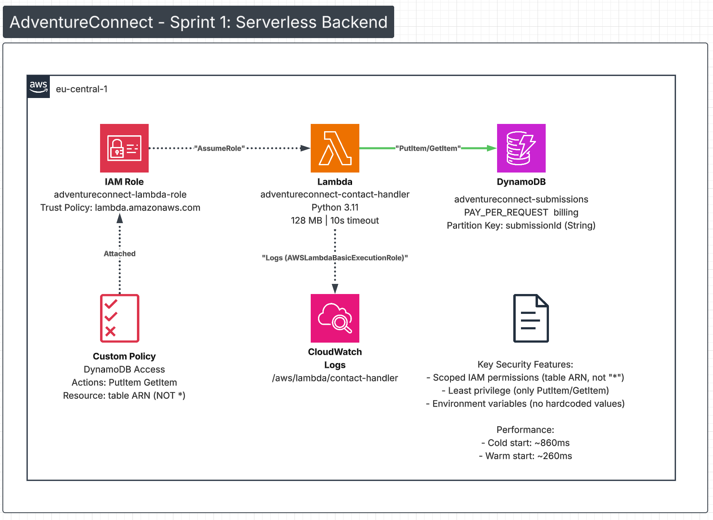

# AdventureConnect Contact System

A serverless contact form system built on AWS using Infrastructure as Code (Terraform). This project demonstrates cloud architecture fundamentals including serverless computing, NoSQL databases, and IAM security best practices.

## Project Status

**Current Phase:** Backend Infrastructure (Sprint 1 Complete ✅)

**Completed:**
- DynamoDB table for contact submissions
- Lambda function for processing form data
- IAM roles and policies with least-privilege permissions

**Next:**
- API Gateway for HTTPS endpoints
- SES email notifications
- S3 static website hosting
- CloudWatch monitoring and alerting

## Architecture

### Architecture Diagram



### Current Components

```
┌─────────────────┐
│  Lambda Function│
│  (Python 3.11)  │
│  - 128MB memory │
│  - 10s timeout  │
└────────┬────────┘
         │
         │ PutItem/GetItem
         │ (scoped permissions)
         ▼
┌─────────────────┐
│  DynamoDB Table │
│  - PAY_PER_REQ  │
│  - submissionId │
└─────────────────┘
```

**Key Design Decisions:**

- **DynamoDB PAY_PER_REQUEST billing**: Auto-scales without capacity planning, ideal for unpredictable contact form traffic
- **Scoped IAM permissions**: Lambda can only PutItem/GetItem on this specific table (not `"*"`)
- **Environment variables**: Table name injected at runtime, no hardcoded values
- **UUID partition key**: Ensures unique identification even with duplicate submissions

### Performance Characteristics

**Cold Start Performance:**
- First invocation: ~860ms (602ms container init + 260ms execution)
- Warm invocations: ~260ms (container reused)

For a contact form, this latency is acceptable. For high-frequency APIs, provisioned concurrency would be considered.

## Project Structure

```
.
├── terraform/
│   ├── provider.tf          # AWS provider configuration
│   ├── dynamodb.tf          # DynamoDB table definition
│   ├── iam.tf               # IAM roles and policies
│   └── lambda.tf            # Lambda function configuration
├── lambda/
│   └── lambda_function.py   # Python handler for form processing
├── decisions.md             # Architectural decisions and trade-offs
├── tshoot.md               # Troubleshooting guides
└── README.md
```

## Prerequisites

- [AWS CLI](https://aws.amazon.com/cli/) configured with credentials
- [Terraform](https://www.terraform.io/downloads) >= 1.0
- AWS account with appropriate permissions

## Deployment

### 1. Clone Repository

```bash
git clone https://github.com/horvrobert/adventureconnect-contact-system.git
cd adventureconnect-contact-system
```

### 2. Package Lambda Function

```bash
cd lambda
zip -r lambda_function.zip lambda_function.py
cd ..
```

### 3. Deploy Infrastructure

```bash
cd terraform
terraform init
terraform plan
terraform apply
```

Type `yes` when prompted to confirm deployment.

### 4. Verify Deployment

```bash
# Check DynamoDB table
aws dynamodb describe-table --table-name adventureconnect-submissions --region eu-central-1

# Check Lambda function
aws lambda get-function --function-name adventureconnect-contact-handler --region eu-central-1

# Check IAM role policies
aws iam list-attached-role-policies --role-name adventureconnect-lambda-role
```

## Testing

### Manual Lambda Test (AWS Console)

1. Navigate to Lambda → Functions → `adventureconnect-contact-handler`
2. Click "Test" tab
3. Create test event with:

```json
{
  "body": "{\"name\":\"Test User\",\"email\":\"test@example.com\",\"message\":\"Test submission\"}"
}
```

4. Click "Test"
5. Verify response shows `statusCode: 200`

### Verify DynamoDB Entry

```bash
aws dynamodb scan --table-name adventureconnect-submissions --region eu-central-1
```

Should return the test submission with generated `submissionId`.

## Key Learnings

### Infrastructure as Code
- Terraform manages all AWS resources declaratively
- State tracking enables safe infrastructure changes
- Resource dependencies handled automatically

### Serverless Architecture
- No server management or provisioning required
- Auto-scaling based on demand
- Pay-per-use pricing model

### IAM Security
- Principle of least privilege applied throughout
- Resource-scoped permissions (not wildcard `"*"`)
- Trust policies control service-to-service access

### DynamoDB Design
- Partition key selection impacts query patterns
- PAY_PER_REQUEST vs PROVISIONED capacity trade-offs
- Schema flexibility for evolving requirements

## Cost Estimation

Current infrastructure costs (monthly, low traffic):

- **DynamoDB**: ~0.23€ (100 writes/day)
- **Lambda**: ~0.18€ (100 invocations/day, 260ms avg duration)
- **Total**: ~0.41€/month

Assumes AWS Free Tier. Production costs scale with usage.

## Roadmap

- [ ] API Gateway REST API endpoint
- [ ] SES email notifications (customer + business)
- [ ] S3 static website hosting
- [ ] CloudFront distribution (optional)
- [ ] CloudWatch dashboards and alarms
- [ ] Comprehensive documentation with architecture diagrams

## Documentation

- **decisions.md**: Architectural decisions, alternatives considered, trade-offs
- **tshoot.md**: Troubleshooting guides for common issues
