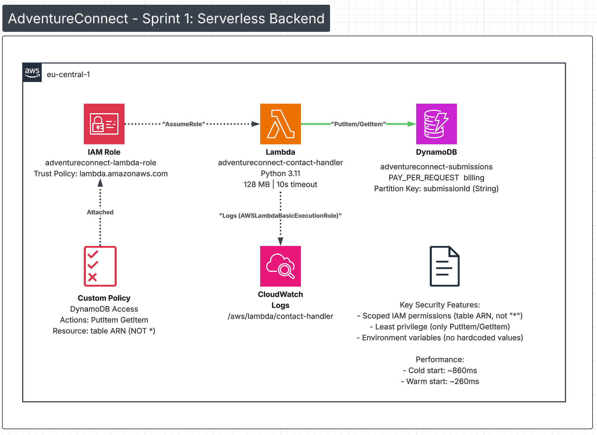
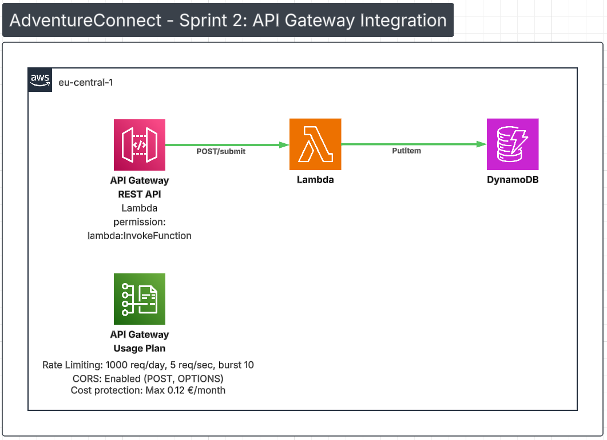
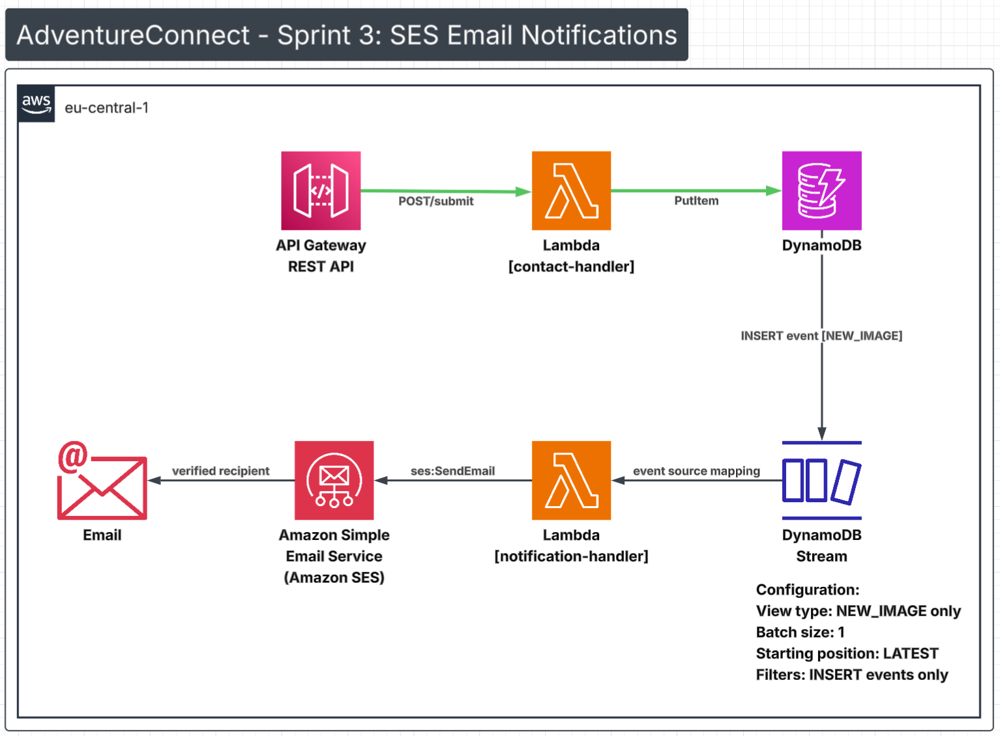
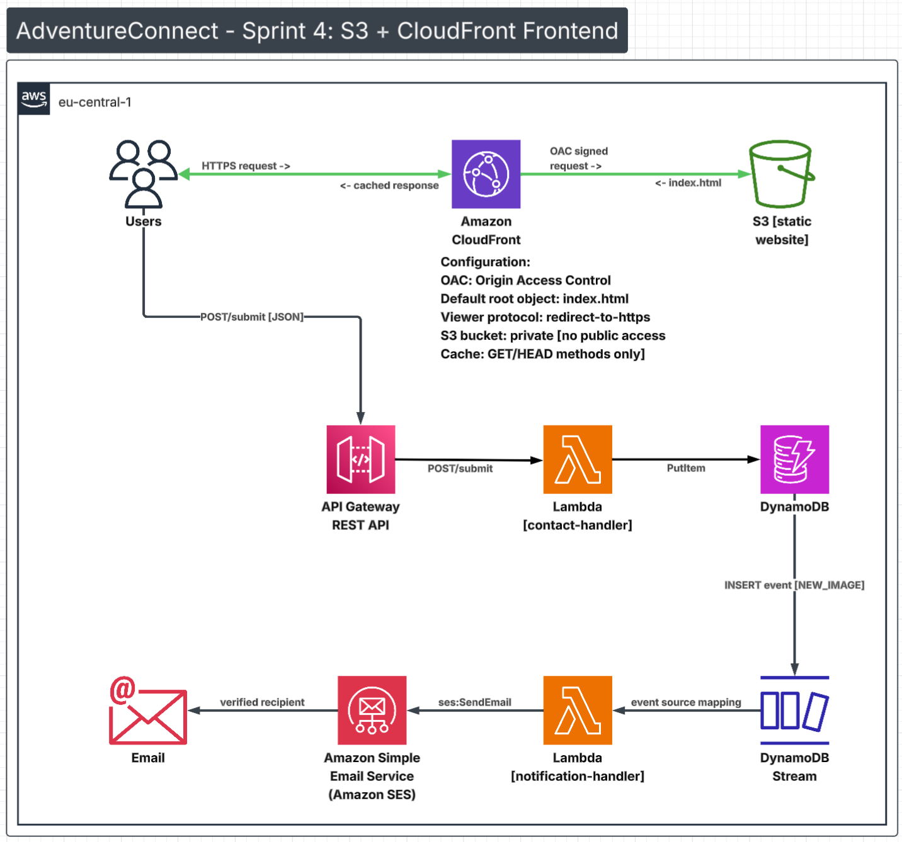
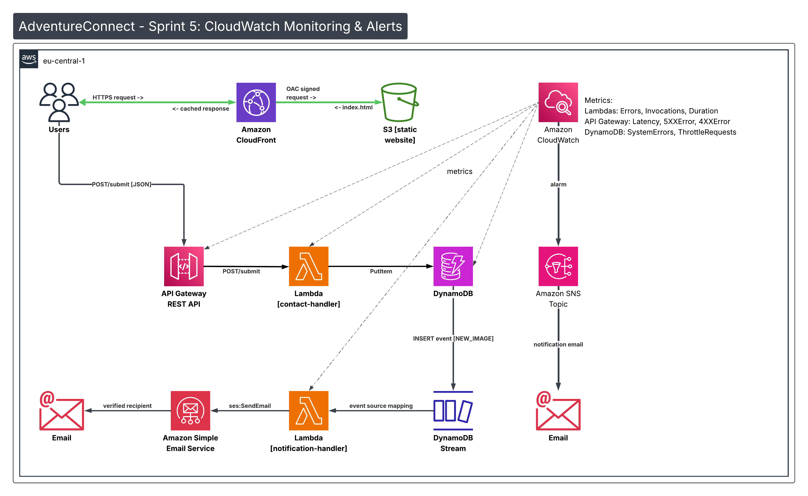
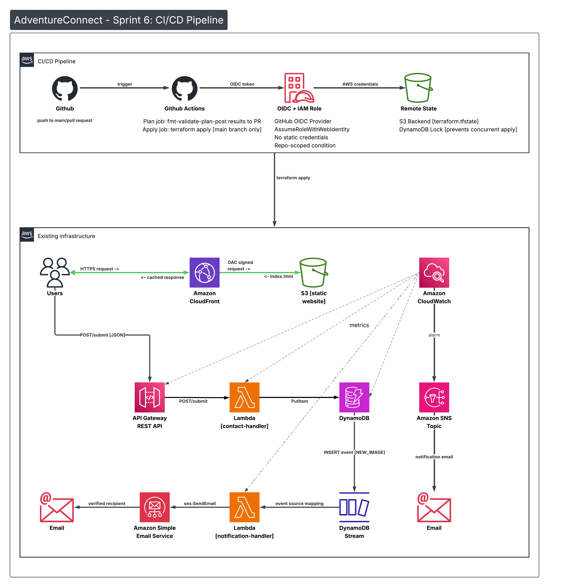

# AdventureConnect Contact System

A serverless contact form on AWS, built entirely with Terraform.

A browser posts to API Gateway → Lambda writes to DynamoDB → a DynamoDB Stream triggers a second Lambda that sends email via SES. The static frontend sits in a private S3 bucket behind CloudFront with Origin Access Control. Eight CloudWatch alarms route to SNS. A GitHub Actions pipeline authenticates to AWS with OIDC — no stored AWS credentials — with remote Terraform state in S3 and DynamoDB locking.

The sections below document each layer of the build, with architecture decisions in `decisions.md` and known limitations at the end of this README.

## Project Status

Self-directed project. The infrastructure has been destroyed to avoid ongoing cost; code, diagrams and documentation remain. Redeploying is not a one-command operation — see [Known Limitations](#known-limitations).

## Architecture

### Serverless Backend



**Components:**
- Lambda function (Python 3.11) processes submissions
- DynamoDB stores data with PAY_PER_REQUEST billing
- IAM roles with scoped permissions (table ARN, not wildcard)
- CloudWatch logs for monitoring

**Key Learning:** Lambda cold starts (~860ms) vs warm starts (~260ms)

### API Gateway Integration



**Components:**
- API Gateway REST API provides public HTTPS endpoint
- CORS enabled for browser cross-origin requests
- Usage plan defined (1000 requests/day, 5 req/sec, burst 10) — **not enforced**, see [Known Limitations](#known-limitations)
- Lambda permission grants API Gateway invocation access

**Key Learning:** Two permission systems — IAM Role (what Lambda can access) vs Lambda Permission (who can invoke Lambda)

### SES Email Notifications



**Components:**
- DynamoDB Streams (NEW_IMAGE) triggers notification Lambda on every INSERT
- Dedicated notification Lambda reads stream record and sends email via SES
- SES delivers email to verified recipient address
- Separate IAM role for notification Lambda — SES permissions isolated from contact handler

**Key Learning:** Event-driven decoupling — form submission succeeds independently of email delivery. SES failures cannot affect the user-facing API response.

**Sandbox limitation:** SES account is in sandbox mode. In production, AWS support request required to send to unverified addresses.

### S3 + CloudFront Frontend



**Components:**
- S3 bucket hosts static HTML/CSS/JS contact form (private, no public access)
- CloudFront distribution serves content over HTTPS with global edge caching
- Origin Access Control (OAC) restricts S3 access to designated CloudFront distribution only
- Bucket policy scoped to specific CloudFront distribution ARN via Condition block
- Terraform outputs expose CloudFront URL and API endpoint after every deployment

**Two separate request flows:**
- Page load: Browser → CloudFront → S3 → index.html returned and cached
- Form submit: Browser → API Gateway → Lambda → DynamoDB → Stream → SES

**Key Learning:** OAC replaces legacy OAI — S3 bucket stays private, CloudFront signs requests using sigv4. S3 static website hosting alone rejected due to lack of HTTPS and public bucket requirement.

### CloudWatch Monitoring & Alerts

 

**Components:**
- SNS topic receives alarm notifications and fans out to email subscriber
- 8 CloudWatch metric alarms covering Lambda, API Gateway, and DynamoDB
- CloudWatch dashboard visualizing all key metrics grouped by service
- Full alert chain: metric breaches threshold → alarm → SNS → email

**Alarms configured:**

| Service | Metric | Threshold |
|---------|--------|-----------|
| Lambda (contact handler) | Errors | 0 |
| Lambda (notification handler) | Errors | 0 |
| Lambda (contact handler) | Duration | 1000ms |
| API Gateway | Latency | 1000ms |
| API Gateway | 5XXError | 0 |
| API Gateway | 4XXError | 10 |
| DynamoDB | SystemErrors | 0 |
| DynamoDB | ThrottledRequests | 0 |

**Key Learning:** CloudWatch cannot email directly — requires SNS as middleman. After `terraform apply`, SNS subscription confirmation email must be clicked or alerts won't deliver. 4XX threshold is 10 (not 0) so stray client errors don't alert on every request; 5XX stays at 0 because those are server-side.

### CI/CD Pipeline & Remote State



**Components:**
- S3 backend stores Terraform state remotely (`robikov-terraform-state-bucket/adventureconnect-contact-system/terraform.tfstate`)
- DynamoDB table (`adventureconnect-terraform-locks`) provides state locking — prevents concurrent applies
- GitHub Actions workflow triggers on push to `main` and pull requests
- OIDC authentication — no long-lived AWS credentials stored anywhere
- IAM role (`adventureconnect-github-actions-role`) assumed by GitHub Actions runner via short-lived token
- Pipeline stages: Checkout → OIDC auth → Terraform init → fmt check → validate → plan → apply

**Pipeline behavior:**
- Push to `main` → full plan + apply (infrastructure deployed automatically)
- Pull request → plan only (no apply; a PR comment confirms the plan step succeeded — the plan output itself is not posted)
- Bootstrap resources were applied locally first — see [Known Limitations](#known-limitations) for how that went wrong

**Key Learning:** OIDC eliminates long-lived credentials. GitHub requests a short-lived token per run, AWS verifies it against the registered OIDC provider, and issues temporary credentials scoped to the specific repository. No secrets to rotate or leak.

## Live Website

After deployment via Terraform, the frontend is accessible at the CloudFront URL:

```
https://{distribution-id}.cloudfront.net
```

Get the URL after deployment:
```bash
terraform output cloudfront_domain_name
```

## API Endpoint

After deployment via Terraform, the API endpoint follows this format:

```
https://{api-id}.execute-api.eu-central-1.amazonaws.com/prod/submit
```

Get the URL after deployment:
```bash
terraform output api_endpoint
```

**Example request:**
```bash
curl -X POST https://abc123xyz.execute-api.eu-central-1.amazonaws.com/prod/submit \
  -H "Content-Type: application/json" \
  -d '{"name":"Test User","email":"test@example.com","message":"Hello"}'
```

**Example response:**
```json
{
  "message": "Submission received",
  "submissionId": "550e8400-e29b-41d4-a716-446655440000"
}
```

**Rate limiting:** a usage plan is defined but not enforced — the method does not require an API key. See [Known Limitations](#known-limitations).

## Project Structure

```
.
├── .github/
│   └── workflows/
│       └── terraform.yml                # GitHub Actions CI/CD pipeline
├── terraform/
│   ├── provider.tf                  # AWS provider + S3 remote backend configuration
│   ├── state.tf                     # DynamoDB state locking table
│   ├── github_oidc.tf               # OIDC identity provider + GitHub Actions IAM role
│   ├── dynamodb.tf                  # DynamoDB table + Streams configuration
│   ├── iam.tf                       # IAM roles and policies (contact handler)
│   ├── lambda.tf                    # Contact form Lambda function
│   ├── api_gateway.tf               # API Gateway REST API + CORS + usage plan
│   ├── notification_lambda.tf       # Notification Lambda + event source mapping
│   ├── notification_iam.tf          # IAM role, SES policy, Stream policy
│   ├── s3.tf                        # S3 bucket + public access block + bucket policy
│   ├── cloudfront.tf                # CloudFront distribution + OAC
│   ├── cloudwatch.tf                # CloudWatch alarms, SNS topic, dashboard
│   ├── outputs.tf                   # CloudFront URL + API endpoint outputs
│   └── variables.tf                 # Input variable definitions
├── lambda/
│   ├── lambda_function.py           # Contact form handler
│   └── notification_handler.py      # SES notification handler
├── diagrams/
│   ├── architecture-sprint1.png
│   ├── architecture-sprint2.png
│   ├── architecture-sprint3.png
│   ├── architecture-sprint4.png
│   ├── architecture-sprint5.png
│   └── architecture-sprint6.png
├── decisions.md                     # Architectural decisions and trade-offs
├── errors.md                        # Issues encountered and fixes
├── testing-log.md                   # Test results and verification
├── tshoot.md                        # Troubleshooting guides
└── README.md
```

## Prerequisites

- [AWS CLI](https://aws.amazon.com/cli/) configured with credentials
- [Terraform](https://www.terraform.io/downloads) >= 1.10
- AWS account with appropriate permissions
- Verified SES email identities in eu-central-1
- GitHub repository with Actions enabled

## Deployment

### Automated Deployment (CI/CD)

Intended flow — the pipeline currently cannot authenticate (see [Known Limitations](#known-limitations)):

1. Make Terraform changes locally
2. Commit and push to `main`
3. GitHub Actions runs: init → fmt check → validate → plan → apply
4. Infrastructure updated in AWS automatically

For pull requests, only `terraform plan` runs — no apply until merged.

### Manual Deployment (Bootstrap only)

Required only for first-time setup or if the OIDC role needs to be recreated.

### 1. Clone Repository

```bash
git clone https://github.com/horvrobert/adventureconnect-contact-system.git
cd adventureconnect-contact-system
```

### 2. Package Lambda Functions

```bash
cd lambda
zip lambda_function.zip lambda_function.py
zip notification_handler.zip notification_handler.py
cd ..
```

### 3. Configure Variables

Create `terraform/terraform.tfvars` (not committed to Git):

```hcl
sender_email    = "your-verified-sender@example.com"
recipient_email = "your-verified-recipient@example.com"
s3_bucket_name  = "your-unique-bucket-name"
```

### 4. Add GitHub Secrets

In GitHub repo → Settings → Secrets and variables → Actions, add:
- `SENDER_EMAIL`
- `RECIPIENT_EMAIL`
- `S3_BUCKET_NAME`

### 5. Deploy Infrastructure

```bash
cd terraform
terraform init
terraform plan
terraform apply
```

### 6. Confirm SNS Subscription

After `terraform apply`, check your email for an SNS confirmation message and click the confirmation link. Without this, CloudWatch alarms will not deliver notifications.

### 7. Upload Frontend

The frontend HTML is not included in this repository.

```bash
aws s3 cp frontend/index.html s3://YOUR-BUCKET-NAME/index.html --region eu-central-1
```

### 8. Get Deployment URLs

```bash
terraform output
```

Update `frontend/index.html` with the `api_endpoint` output value, then re-upload and invalidate CloudFront cache:

```bash
aws cloudfront create-invalidation --distribution-id YOUR-DIST-ID --paths "/*" --region eu-central-1
```

### 9. Verify Deployment

```bash
# Check SNS subscription status
aws sns list-subscriptions-by-topic --topic-arn YOUR-TOPIC-ARN --region eu-central-1

# Check CloudWatch alarms
aws cloudwatch describe-alarms --region eu-central-1 --output table

# Check S3 bucket
aws s3 ls s3://YOUR-BUCKET-NAME --region eu-central-1

# Check Lambda functions
aws lambda get-function --function-name adventureconnect-contact-handler --region eu-central-1
aws lambda get-function --function-name adventureconnect-notification-handler --region eu-central-1

# Check event source mapping (Stream → notification Lambda)
aws lambda list-event-source-mappings --function-name adventureconnect-notification-handler --region eu-central-1
```

## Testing

### Full End-to-End Test (Browser)

1. Open `https://{your-cloudfront-url}.cloudfront.net` in browser
2. Fill in name, email, message
3. Click Send Message
4. Verify success message displayed
5. Check inbox for notification email
6. Check CloudWatch dashboard — Lambda Invocations metric should show a data point

### Full End-to-End Test (curl)

```bash
curl -X POST https://YOUR-API-ID.execute-api.eu-central-1.amazonaws.com/prod/submit \
  -H "Content-Type: application/json" \
  -d '{"name":"Test User","email":"test@example.com","message":"Test submission"}'
```

Expected: `{"message":"Submission received","submissionId":"uuid-here"}`

### Verify DynamoDB Entries

```bash
aws dynamodb scan --table-name adventureconnect-submissions --region eu-central-1 --output table
```

### Check CloudWatch Logs

```bash
# Contact handler logs
aws logs tail /aws/lambda/adventureconnect-contact-handler --follow --region eu-central-1

# Notification handler logs
aws logs tail /aws/lambda/adventureconnect-notification-handler --follow --region eu-central-1
```

### Check CloudWatch Alarms

```bash
aws cloudwatch describe-alarms --region eu-central-1 --query 'MetricAlarms[].{Name:AlarmName,State:StateValue}' --output table
```

## Key Learnings

### Serverless Backend

**Infrastructure as Code:** Terraform manages all AWS resources declaratively. State tracking enables safe infrastructure changes. Resource dependencies handled automatically.

**IAM Security:** Principle of least privilege applied throughout. Resource-scoped permissions (table ARN, not wildcard). Trust policies control service-to-service access.

**DynamoDB Design:** Partition key selection (UUID ensures uniqueness). PAY_PER_REQUEST vs PROVISIONED capacity trade-offs. Auto-scaling without capacity planning.

### API Gateway Integration

**Two Permission Systems:** IAM Role controls what Lambda can access (DynamoDB, CloudWatch). Lambda Permission controls who can invoke Lambda (API Gateway, EventBridge). Removing Lambda permission causes 500 error with no CloudWatch logs — Lambda is never invoked.

**CORS Configuration:** OPTIONS method with MOCK integration returns CORS headers without invoking Lambda (~10ms vs ~200ms). Browser preflight requests require proper headers. MOCK eliminates 50% of Lambda invocations on browser traffic.

**Rate Limiting — what went wrong:** The usage plan was never enforced. Usage plan throttling and quotas apply only to requests carrying an API key, and the method does not require one. For a public browser form, stage-level throttling, AWS WAF rate-based rules and a Budgets alarm are the right controls.

### Event-Driven Architecture

**Decoupling via DynamoDB Streams:** Form submission and email delivery are independent operations. SES failure cannot cause form submission to fail. Stream retries automatically on notification Lambda failure — by default until the record expires, so one bad record can block the notifications behind it.

**DynamoDB Typed Attribute Format:** Stream records deliver values as `{"S": "value"}` not `"value"`. Every attribute must be unwrapped with the type key (`["S"]`, `["N"]`, etc.). Missing this produces malformed output with no obvious error.

**IAM Blast Radius:** Notification Lambda has its own IAM role with only SES and Stream permissions. Contact handler role has no SES access. Compromise of one Lambda cannot be used to exploit the other.

### Static Website Hosting

**Two Request Flows:** Page load goes Browser → CloudFront → S3. Form submission goes Browser → API Gateway directly. CloudFront is not involved in form submission — it only serves static files.

**OAC vs OAI:** Origin Access Control replaces legacy Origin Access Identity. OAC uses sigv4 request signing, supports SSE-KMS, and is the current AWS-recommended approach.

**S3 Security:** All four public access block settings enabled. Bucket has no public access — only CloudFront can read from it via OAC. Direct S3 URL access returns 403.

### CloudWatch Monitoring

**Notification Chain:** CloudWatch cannot email directly. Full chain: metric breaches threshold → alarm state changes → SNS topic fires → email delivered. SNS subscription must be confirmed after deployment or alerts are silently dropped.

**Alarm Thresholds:** Error alarms use threshold 0 — any error is a problem. Duration alarm uses 1000ms (not the 10s timeout) for early warning before Lambda actually fails. 4XX alarm uses threshold 10 so stray client errors don't alert on every request; the value is a judgement call, not derived from traffic data.

**Dashboard vs Alarms:** Dashboard provides visibility, alarms provide action. Both are needed — dashboard for operational awareness during incidents, alarms for proactive notification when something breaks.

### CI/CD Pipeline & Remote State

**Remote State:** Terraform state stored in S3 with DynamoDB locking. Multiple operators (or pipeline runners) cannot corrupt state by running concurrent applies. Versioning on the state bucket enables rollback to earlier state — it was not enabled while this project ran.

**OIDC vs Access Keys:** OIDC eliminates long-lived credentials entirely. GitHub runner requests a short-lived token, AWS verifies the token against the OIDC provider and checks the repo condition, then issues temporary credentials. Nothing to rotate, nothing to leak.

**Pipeline Gates:** `terraform fmt -check` and `terraform validate` run before plan — broken or unformatted code fails fast before touching AWS. Plan runs before apply, but the apply job re-plans with `-auto-approve` rather than applying the saved plan, so the reviewed plan is not guaranteed to be the applied one.

**Bootstrap Problem:** OIDC provider and IAM role must exist before the pipeline can authenticate. These were created locally via `terraform apply` before `github_oidc.tf` was committed — the first successful pipeline run then most likely removed them. See [Known Limitations](#known-limitations).

## Cost Estimation

**Estimated at 100 submissions/day:**

| Service | Usage | Monthly Cost |
|---------|-------|--------------|
| API Gateway | 3,000 requests | 0.009€ |
| Lambda (contact handler) | 3,000 invocations | 0€ (free tier) |
| Lambda (notification) | 3,000 invocations | 0€ (free tier) |
| DynamoDB | 3,000 writes | 0.003€ |
| DynamoDB Streams | 3,000 reads | 0€ (free tier) |
| SES | 3,000 emails | 0€ (first 62,000/month free) |
| S3 | 3,000 GET requests | 0€ (free tier) |
| CloudFront | 3,000 requests | 0€ (free tier) |
| CloudWatch | 8 alarms + 1 dashboard | 0€ (free tier) |
| SNS | 3,000 notifications | 0€ (first 1M/month free) |
| **Total** | | **~0.012€** |

**All costs calculated in Euro (€) using 1 USD = 0.86 EUR**

## Known Limitations

Reviewed September 2026. These are real gaps in the code as it stands, left documented rather than changed, because the infrastructure is destroyed and untested fixes would be worse than documented ones.

- **Usage plan is not enforced.** Usage plan throttling and quotas apply only to requests that carry an API key, and the `POST /submit` method does not require one. Requests are limited only by API Gateway's account-level throttling. For a public browser form an API key is the wrong control anyway — it would be visible in the page source. Stage-level throttling, AWS WAF rate-based rules and an AWS Budgets alarm are the appropriate controls.
- **The pipeline lost its own authentication.** The OIDC provider and CI role were created with a local `terraform apply` before `github_oidc.tf` was committed. The first successful pipeline run (4 March 2026) applied a commit without that file, and Terraform most likely destroyed the OIDC resources it found in state but not in code. Every run since has failed at authentication. The apply log has expired, so the destroy itself cannot be confirmed. Bootstrap resources — state backend, lock table, OIDC provider, CI role — belong in a separate configuration and state from the project they authenticate.
- **CI role is over-privileged.** Service wildcards including `iam:*` on `Resource = "*"`, and a trust policy that accepts any branch of the repository. It should be split into a read-only plan role and an apply role restricted to `refs/heads/main`, with actions scoped to this project's resources.
- **The applied plan is not the reviewed plan.** The plan job saves `tfplan`, but the apply job re-plans with `-auto-approve` instead of applying the saved file. The PR comment confirms the plan step ran; it does not contain the plan.
- **Lambda code is not built or tracked by Terraform.** Deployment zips are gitignored and never built in CI, and neither function sets `source_code_hash`, so code changes are not detected.
- **Stream failure handling uses defaults.** The event source mapping sets no retry limit, batch bisection or on-failure destination, so a failing record is retried until it expires (up to 24 hours) and blocks records behind it. The notification handler re-raises, which retries the whole batch and can resend emails already sent. No alarm on `IteratorAge`.
- **No input validation.** Malformed JSON returns 500 rather than 400, which also triggers the 5XX alarm. A submission missing a field is stored, then fails the notification handler.
- **Frontend is not in this repository.**
- **Account-level OIDC provider is created by more than one project** in the same AWS account, so a second project's apply fails.
- **The state lock table is managed in the same state it locks**, so `terraform destroy` removes it.

## Documentation

- **decisions.md** — Architectural decisions, alternatives considered, trade-offs
- **errors.md** — Issues encountered, root causes, fixes applied
- **testing-log.md** — Test results, inputs, outputs, execution metrics
- **tshoot.md** — Troubleshooting guides for common failure scenarios
